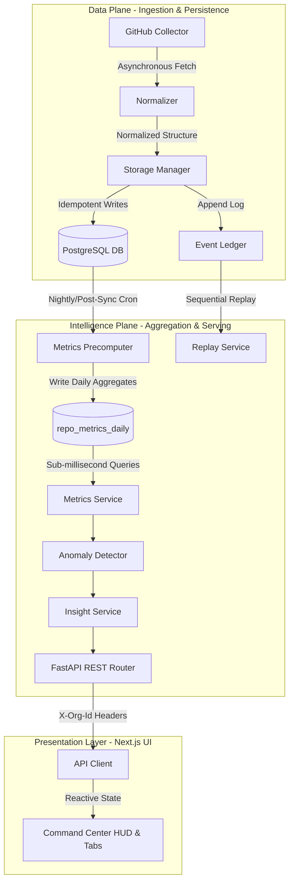

# 📊 CodePulse — Engineering Intelligence Platform


CodePulse is a high-performance, enterprise-grade Engineering Intelligence and Decision Support Platform that connects directly to GitHub API endpoints to ingest, normalize, and precompute software development lifecycle (SDLC) metrics. It translates telemetry logs into concrete management action recommendations inside a real-time **Command Center**.

---

## 🏗️ Core Architecture & Decoupled Planes

CodePulse is built on a clean separation of concerns, decoupling raw ingestion streams from analysis services. The codebase is architected into two separate layers to handle heavy scale:




### 1. Data Plane (`backend/app/data_plane/`)

The **Data Plane** processes incoming data from GitHub webhooks or REST/GraphQL collectors, sanitizes it, and saves it in the database.

* **GitHub Collector (`ingestion/github_collector.py`)**: Connects to the GitHub GraphQL API, fetching pull requests, reviews, commits, and comments. It features an adaptive **Quota-Aware Scheduler** to dynamically throttle requests based on API limits.

* **Normalizer (`normalization/normalizer.py`)**: Sanitizes diverse, nested JSON payloads, converting them into typed dictionaries with timezone-aware UTC timestamps.

* **Storage Manager (`storage/storage_manager.py`)**: Coordinates execution of synchronization logs and writes data. It uses PostgreSQL upsert (`ON CONFLICT DO UPDATE`) commands to prevent writing duplicate records.

* **Event Ledger (`storage/models/event.py`)**: Logs immutable timeline events (e.g., `PR_CREATED`, `PR_MERGED`, `COMMIT_PUSHED`, `REVIEW_SUBMITTED`). This log acts as a single source of truth for rebuilding database tables.


### 2. Intelligence Plane (`backend/app/intelligence_plane/`)

The **Intelligence Plane** aggregates raw data points into actionable insights.

* **Precomputed Metrics Layer (`metrics/precomputer.py`)**: Compiles performance metrics daily over the trailing 90 days, storing the results in `repo_metrics_daily`. Read operations run in $O(1)$ time, bypassing heavy tables scans.

* **Anomaly Detector (`anomalies/anomaly_detector.py`)**: Scans daily aggregations using statistical controls to flag anomalies:
  * **WIP Overload**: Open PR volume exceeding 2.5x weekly throughput.
  * **Cycle Time Spikes**: Individual merged PRs exceeding 2 standard deviations (+2σ) from the 30-day mean.
  * **Reviewer Bottlenecks**: Single reviewers handling >50% of reviews.
  * **PR Size Exceptions**: Submissions containing >500 lines changed.

* **Insight Service (`insights/insight_service.py`)**: Formulates actionable recommendations using a 3-layer reasoning model:
  1. *Rule Engine (Deterministic)*: Flags immediate process bottlenecks.
  2. *Statistical Layer (Trend Analysis)*: Identifies percentage shifts and trend deviations.
  3. *Interpretive Layer (Generative Summary)*: Provides causal summaries explaining "why did this happen".

---

## 🗄️ Database Schema & Data Models

CodePulse uses a relational PostgreSQL schema designed for high-performance indexing:

| Table Name | Primary Purpose | Key Fields | Performance Indices |
| :--- | :--- | :--- | :--- |
| `repositories` | Tracked GitHub repositories | `id`, `github_id`, `full_name`, `org_id` | `idx_repos_org` |
| `pull_requests` | Core development cycle records | `id`, `github_id`, `number`, `state`, `author` | `idx_prs_repo_state` |
| `commits` | Line change metrics & histories | `id`, `sha`, `author`, `additions`, `deletions` | `idx_commits_repo_sha` |
| `reviews` | Code review workflows & latencies | `id`, `github_id`, `state`, `reviewer` | `idx_reviews_pr` |
| `events` | Immutable timeline transaction log | `id`, `type`, `idempotency_key`, `payload` | `idx_events_idempotency` |
| `repo_metrics_daily` | Precomputed daily aggregates | `id`, `repo_id`, `date`, `wip`, `cycle_time_avg` | `idx_metrics_repo_date` |
| `sync_logs` | Background synchronization history | `id`, `repo_id`, `status`, `started_at` | `idx_sync_repo` |

---

## 🔒 Multi-Tenant SaaS Isolation

CodePulse includes built-in multi-tenant isolation, ensuring that organization resources are strictly separated:

* **Organization Scoping**: All repositories are assigned an `org_id` (defaulting to `"default_org"`).

* **Header Injection**: The Next.js API client injects an `X-Org-Id` header into all HTTP requests.

* **API Interceptors**: The FastAPI backend employs a `verify_repo_access` dependency. It extracts `X-Org-Id` and verifies that the tenant has permissions to access the requested repository. Unauthorized requests return an HTTP 403 Forbidden status.

---

## ⚡ Adaptive Quota-Aware Ingestion Scheduler

The GitHub API limits clients to a maximum of 5,000 points per hour. To prevent API lockout during large sync runs, CodePulse uses a **Quota-Aware Scheduler**:

```
Let:
  Q = Usable GitHub API Quota remaining
  T = Time remaining until quota reset (seconds)
  B = Safety Buffer (Default: 100 points)

Allowed Rate (Req/Sec):
  R = (Q - B) / T
```

* If Q <= B, the scheduler halts all execution, waiting until the rate limit window resets.
* If Q > B, requests are paced using dynamic sleep intervals (1/R seconds) between consecutive API requests.

---

## 📂 Directory Layout

```
codepulse/
├── backend/
│   ├── alembic/                # Relational schema migrations
│   ├── app/
│   │   ├── api/                # Base routing configurations
│   │   ├── core/               # Configuration settings and DB pools
│   │   ├── data_plane/         # Normalization and ingestion modules
│   │   │   ├── ingestion/      # GitHub Collectors and Quota-Aware Scheduler
│   │   │   ├── normalization/  # Payload transformers
│   │   │   └── storage/        # DB Transaction boundaries & State Replay
│   │   ├── intelligence_plane/ # Computation engines & API routes
│   │   │   ├── anomalies/      # Statistical outlier alerts
│   │   │   ├── api/            # Scoped REST API Endpoints
│   │   │   ├── insights/       # 3-layer decision analytics
│   │   │   └── metrics/        # Daily metrics precompilation
│   │   ├── schemas/            # Pydantic serialization definitions
│   │   └── main.py             # FastAPI bootstrap entrypoint
│   ├── tests/                  # Pytest execution scripts
│   └── Dockerfile              # Multi-stage secure python builder
├── frontend/
│   ├── public/                 # Static graphical assets
│   ├── src/
│   │   ├── __tests__/          # Vitest React tests
│   │   ├── app/                # Next.js pages: dashboard, insights, repos
│   │   ├── components/         # HUD panels, accordions, charts
│   │   ├── lib/                # API wrapper client
│   │   └── types/              # Unified TypeScript interfaces
│   └── Dockerfile              # Standalone Next.js multi-stage build
├── docker-compose.yml          # Top-level Docker runtime stack
├── .env.example                # Template environments configurations
└── LICENSE                     # MIT License File
```

---

## 🛠️ Local Development & Quickstart

Follow these instructions to run CodePulse on your system:

### 1. Configure the Environment
Duplicate the environment template file:
```bash
cp .env.example .env
```
Fill in the GitHub Developer client credentials and a random secret key for token signing.

### 2. Launching with Docker Compose (Recommended)
This command builds the frontend and backend applications, sets up PostgreSQL and Redis, and connects them inside an isolated network bridge:
```bash
docker compose up -d --build
```
* **Frontend Command Center**: http://localhost:3000
* **Backend API Docs (Swagger UI)**: http://localhost:8000/docs

### 3. Launching Bare-Metal (Manual Installation)

#### Backend Setup
```bash
cd backend
python -m venv .venv
source .venv/bin/activate  # On Windows: .venv\Scripts\activate

# Install dependencies
pip install -r requirements.txt

# Run migrations
python -m alembic upgrade head

# Start API dev server
python -m uvicorn app.main:app --reload --port 8000
```

#### Frontend Setup
```bash
cd frontend
npm install
npm run dev
```
Open http://localhost:3000 in your web browser.

---

## 🧪 Testing

CodePulse includes unit and integration test suites:

### 1. Pytest Backend Suite
```bash
cd backend
$env:PYTHONPATH="."  # On macOS/Linux: export PYTHONPATH=.
.venv/Scripts/pytest  # On macOS/Linux: .venv/bin/pytest
```

### 2. Vitest Frontend Suite
```bash
cd frontend
npx vitest run
```

---

## 🚀 Vercel Production Deployment Settings

Since the frontend is built using Next.js, it can be deployed directly to Vercel:

### 1. Project Configuration
* **Framework Preset**: Next.js
* **Root Directory**: frontend (Ensure Vercel targets the frontend subdirectory)
* **Build Command**: npm run build
* **Output Directory**: .next

### 2. Environment Variables
Add these values in the Vercel Dashboard under **Settings > Environment Variables**:
* `NEXT_PUBLIC_API_URL`: Your backend endpoint (e.g., https://api.codepulse.yourdomain.com/api/v1).
* `AUTH_GITHUB_ID`: Your GitHub OAuth App Client ID.
* `AUTH_GITHUB_SECRET`: Your GitHub OAuth App Client Secret.
* `AUTH_SECRET`: A secure, randomly generated 32-character encryption secret.
* `NEXTAUTH_URL`: Your Vercel deployment URL (e.g., https://codepulse-dashboard.vercel.app).

### 3. API Rewrites/Proxy Configuration (Optional)
To route backend requests through the same domain and bypass CORS issues, add rewrite configurations in [frontend/next.config.ts](file:///c:/Users/Yusuf/Desktop/codepulse/frontend/next.config.ts):
```typescript
import type { NextConfig } from "next";

const nextConfig: NextConfig = {
  output: "standalone",
  async rewrites() {
    return [
      {
        source: "/api/v1/:path*",
        destination: `${process.env.BACKEND_API_URL}/api/v1/:path*`,
      },
    ];
  },
};

export default nextConfig;
```

---

## 📜 Licensing & Legal Terms

Distributed under the **MIT License**. See [LICENSE](file:///c:/Users/Yusuf/Desktop/codepulse/LICENSE) for more details.

Created and maintained by **Yusuf Çalışır**.